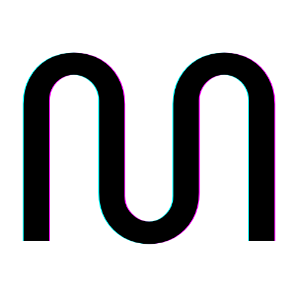
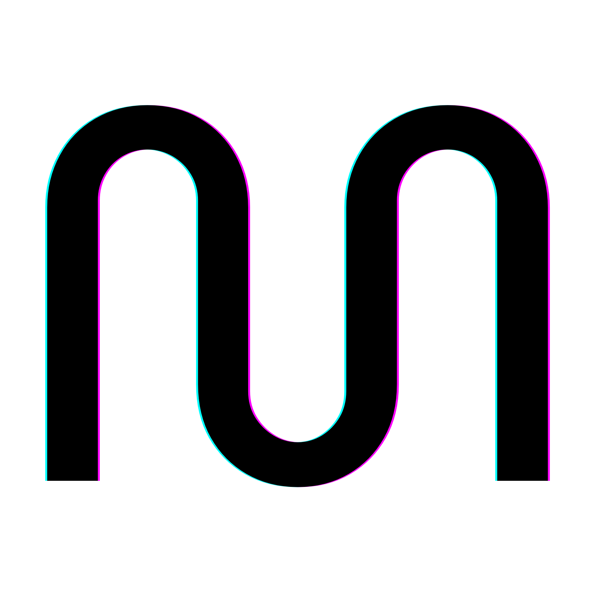

# [logo.salomos.com](http://logo.salomos.com)

## Image Links

### 250x250
     
    
    
    

### 500x500
    
    
     
    

### 750x750 
    
    
    
    

### 1500x1500
    
     
    
    

## Sitemap

A `sitemap.xml` file has been added to this project to provide a structured listing of all the files for search engines and other tools.

The sitemap includes:

- The README.md and salomos.pdf files at the root level
- All the numbered PNG files in the 250, 500, 750, and 1500 directories

Each file is listed with its full path as the URL, relative to the root of the site. The sitemap follows the standard XML sitemap protocol.

This sitemap provides a comprehensive and search engine friendly overview of all the content in this project. It can be submitted to search engines or used by other tools to better understand and navigate the site structure.
